# Project Flow Documentation

## Table of Contents
1. [System Architecture Overview](#system-architecture-overview)
2. [Application Startup Flow](#application-startup-flow)
3. [Document Ingestion Flow](#document-ingestion-flow)
4. [PDF Upload Flow](#pdf-upload-flow)
5. [Query/RAG Flow](#queryrag-flow)
6. [Document Management Flow](#document-management-flow)
7. [Dependency Injection & Container Flow](#dependency-injection--container-flow)
8. [Error Handling Flow](#error-handling-flow)

---

## System Architecture Overview

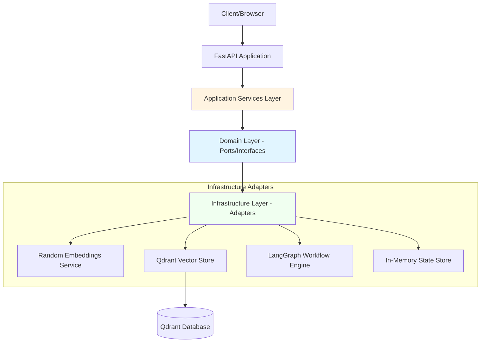

---

## Application Startup Flow

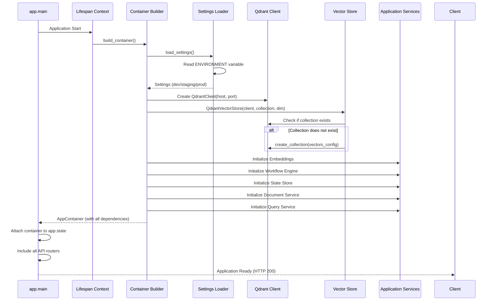

### Startup Flow Details

1. **Environment Detection**
   - Reads `ENVIRONMENT` variable (dev/staging/prod)
   - Loads appropriate config class

2. **Qdrant Initialization**
   - Connects to Qdrant at configured host:port
   - Creates or verifies collection existence
   - Sets up vector parameters (dimension, distance metric)

3. **Service Wiring**
   - All services are instantiated with their dependencies
   - Dependency injection happens through constructor parameters
   - Container holds all service instances

4. **Router Registration**
   - Document routes
   - Query routes
   - Health check routes
   - Debug routes
   - Counter routes (example stateful service)

---

## Document Ingestion Flow

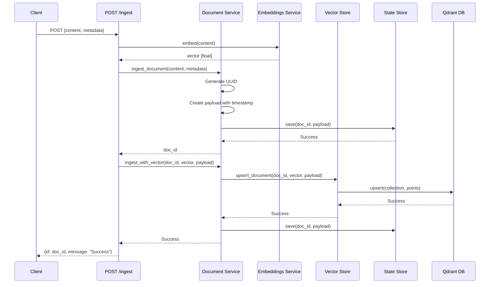

### Ingestion Flow Breakdown

1. **Request Reception**
   - Validate input schema (DocumentInput)
   - Extract content and metadata

2. **Embedding Generation**
   - Convert text content to vector representation
   - Currently uses RandomEmbeddingsService (deterministic random)

3. **Document ID Creation**
   - Generate unique UUID for document
   - Create payload with content, metadata, timestamp

4. **Dual Storage**
   - **State Store**: Stores raw document data (debugging/inspection)
   - **Vector Store**: Stores embedding + payload in Qdrant

5. **Response**
   - Return document ID to client for future reference

---

## PDF Upload Flow

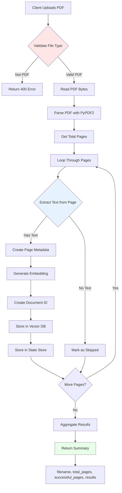

### PDF Processing Details

**Per Page:**
- Extract text content
- Generate unique document ID
- Create metadata:
  ```json
  {
    "filename": "document.pdf",
    "page_number": 1,
    "total_pages": 10,
    "content_type": "application/pdf"
  }
  ```
- Generate embedding vector
- Store with metadata in Qdrant

**Response Structure:**
```json
{
  "filename": "document.pdf",
  "total_pages": 10,
  "successful_pages": 8,
  "results": [
    {"page": 1, "id": "uuid", "status": "success", "chars": 1234},
    {"page": 2, "status": "skipped", "reason": "No text found"},
    {"page": 3, "status": "error", "error": "Parse error"}
  ]
}
```

---

## Query/RAG Flow

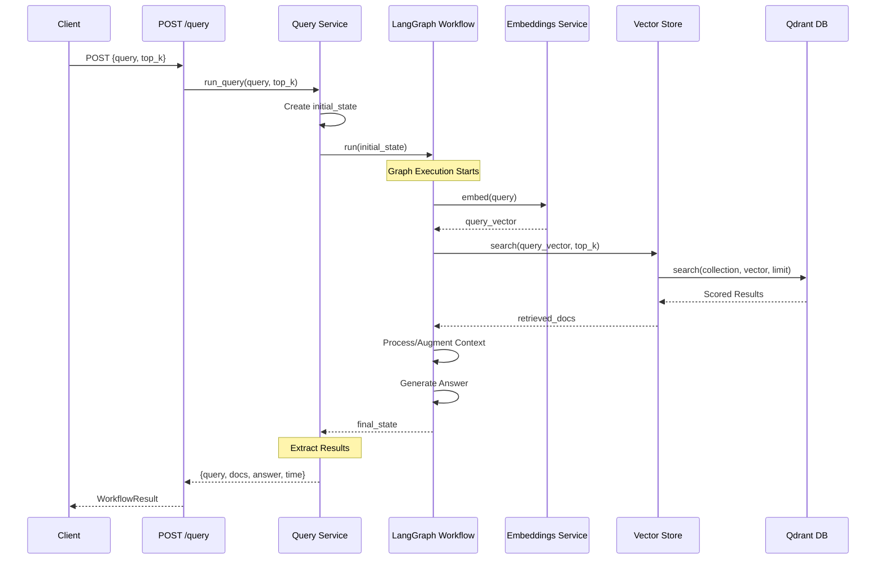

### RAG Flow Breakdown

**Initial State Creation:**
```python
{
    "query": "user question",
    "top_k": 5,
    "retrieved_docs": [],
    "final_answer": "",
    "processing_steps": [],
    "error": None
}
```

**LangGraph Workflow Steps:**
1. **Embed Query**: Convert user query to vector
2. **Retrieve**: Search Qdrant for similar documents
3. **Augment**: Add retrieved context to state
4. **Generate**: Create answer based on context
5. **Return**: Final state with answer

**Response Format:**
```json
{
  "initial_query": "What is RAG?",
  "retrieved_docs": [
    {
      "id": "uuid",
      "content": "RAG stands for...",
      "score": 0.95
    }
  ],
  "final_answer": "RAG (Retrieval Augmented Generation)...",
  "processing_time": 0.234
}
```

---

## Document Management Flow

### List Documents


**Response:**
```json
{
  "documents": [
    {
      "id": "uuid",
      "content": "First 100 chars...",
      "metadata": {"source": "api"}
    }
  ]
}
```

### Delete Document

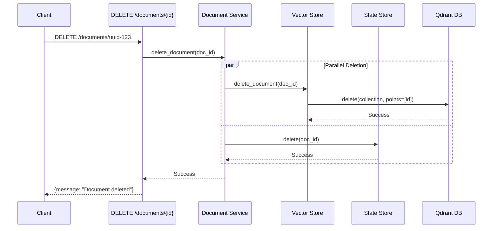

---

## Dependency Injection & Container Flow

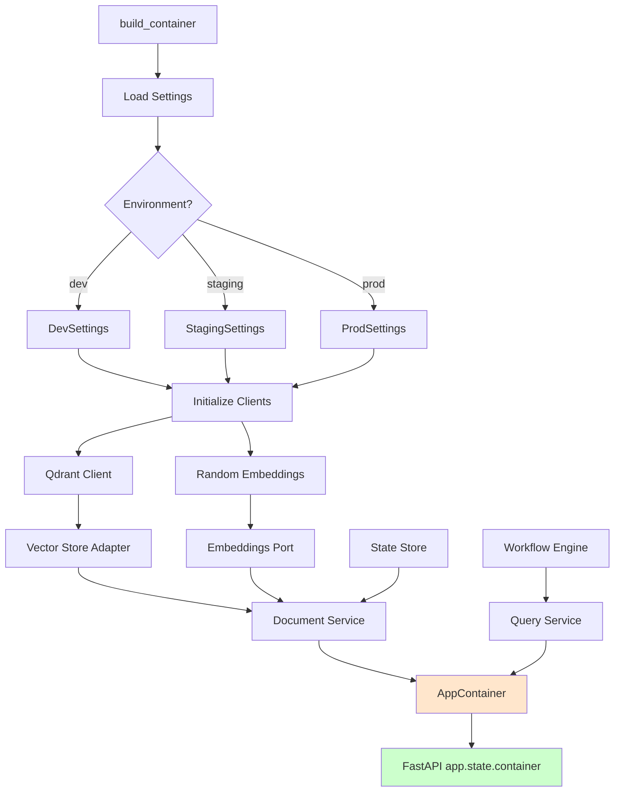

### Dependency Graph

```
Settings
    ├── Qdrant Client
    │   └── Vector Store (Infrastructure)
    │       └── Document Service (Application)
    │
    ├── Random Embeddings (Infrastructure)
    │   └── Workflow Engine (Infrastructure)
    │       └── Query Service (Application)
    │
    └── State Store (Infrastructure)
        └── Document Service (Application)
```

### Dependency Access in Routes

```python
# Dependency injection in FastAPI routes
@router.post("/ingest")
async def ingest_document(
    doc: DocumentInput,
    container: AppContainer = Depends(get_container),
    document_service: DocumentService = Depends(get_document_service),
):
    # Use injected dependencies
    vector = container.embeddings.embed(doc.content)
    doc_id = await document_service.ingest_document(...)
```

---

## Error Handling Flow

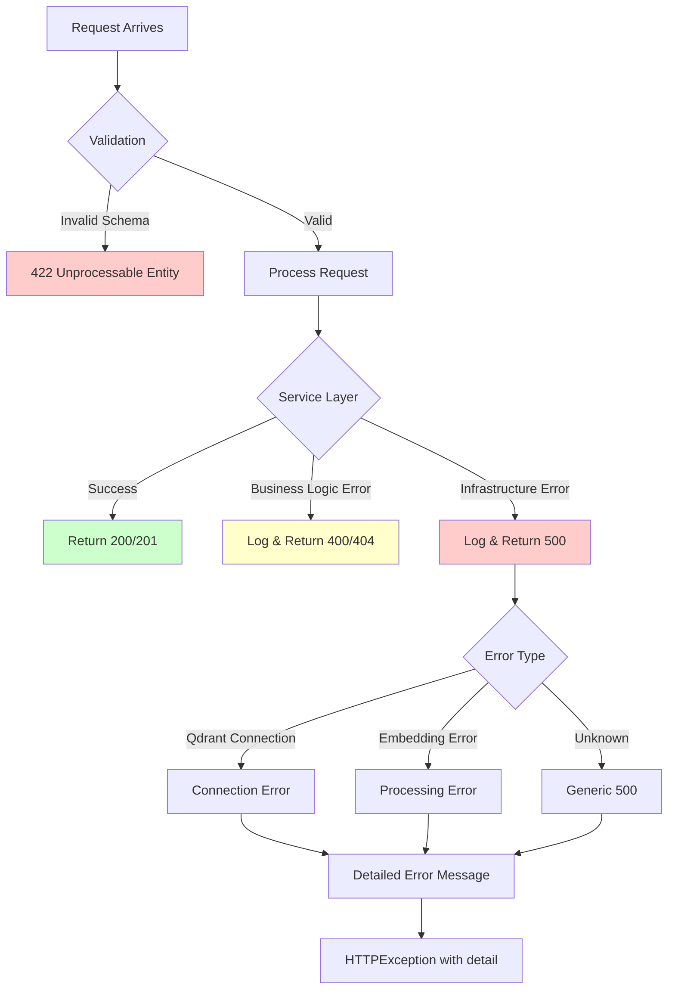

### Error Categories

**1. Validation Errors (422)**
- Invalid request schema
- Missing required fields
- Type mismatches

**2. Client Errors (400, 404)**
- Document not found
- Invalid file type (non-PDF)
- Business rule violations

**3. Server Errors (500)**
- Qdrant connection failures
- Database errors
- Unexpected exceptions

### Error Response Format

```json
{
  "detail": "Detailed error message explaining what went wrong"
}
```

---

## Complete Request-Response Flow

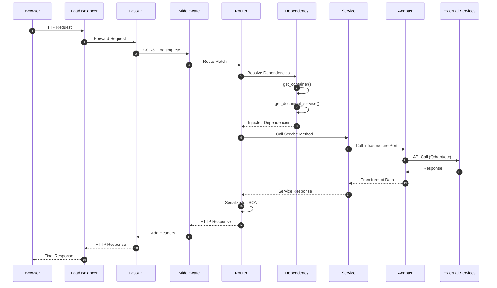

---

## Configuration Flow by Environment

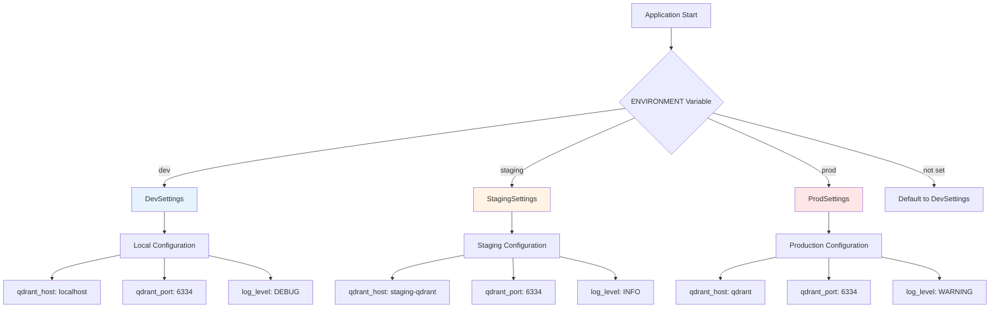

---

## Testing Flow

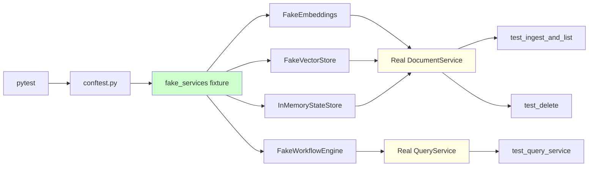

### Test Isolation

- **Unit Tests**: Use fake implementations
- **No External Dependencies**: Tests run without Qdrant, LangGraph, etc.
- **Fast Execution**: All in-memory operations
- **Deterministic**: Same input = same output

---

## Docker Deployment Flow

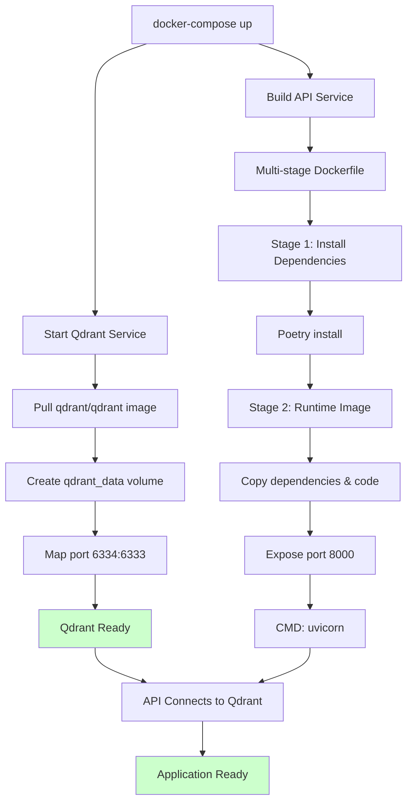

---

## CI/CD Pipeline Flow

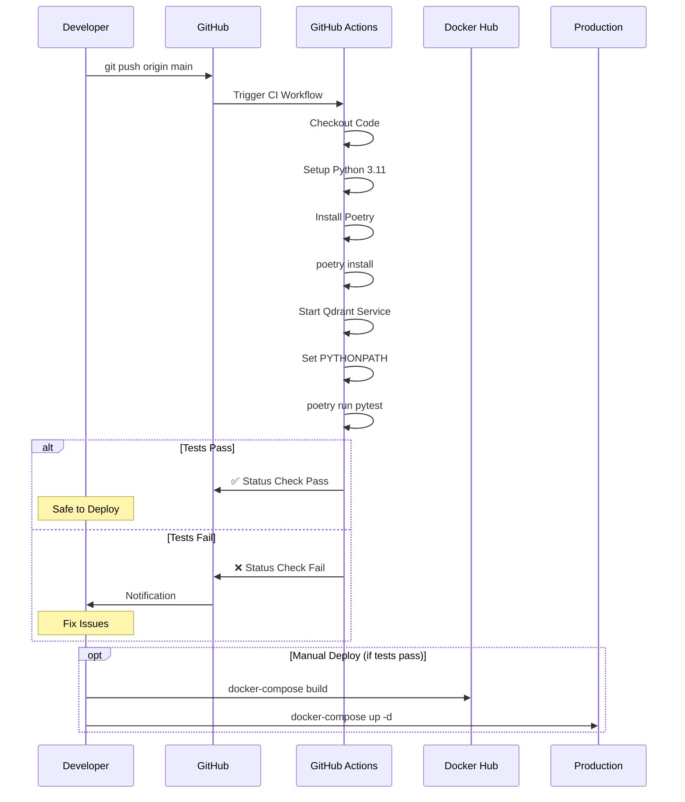

---

## Summary of Key Flows

### 1. **Request Flow**
```
Client → FastAPI → Router → Dependency Injection → Service → Adapter → External Service
```

### 2. **Data Flow**
```
Raw Text → Embedding → Vector Store (Qdrant) → Retrieval → Context → LLM → Answer
```

### 3. **Configuration Flow**
```
ENV Variable → Settings Class → Container → Services → Infrastructure
```

### 4. **Error Flow**
```
Exception → Service Layer → HTTPException → FastAPI → JSON Error Response
```

### 5. **Test Flow**
```
pytest → Fixtures → Fakes → Real Services → Assertions
```

---

## Architecture Principles Applied

### 1. **Clean Architecture**
- **Independence**: Domain doesn't know about infrastructure
- **Testability**: Services tested with fakes
- **Flexibility**: Easy to swap implementations

### 2. **Hexagonal Architecture**
- **Ports**: Defined in domain layer
- **Adapters**: Implemented in infrastructure
- **Dependency Inversion**: Services depend on abstractions

### 3. **Dependency Injection**
- **Container Pattern**: Central wiring
- **Constructor Injection**: Dependencies passed explicitly
- **Lifecycle Management**: Single instance per request

### 4. **SOLID Principles**
- **Single Responsibility**: Each service has one job
- **Open/Closed**: Extend via new adapters, not modifications
- **Liskov Substitution**: Ports can be swapped
- **Interface Segregation**: Small, focused ports
- **Dependency Inversion**: Depend on abstractions

---

## Performance Considerations

### Optimization Points

1. **Embedding Cache**: Cache frequently used embeddings
2. **Connection Pooling**: Reuse Qdrant connections
3. **Batch Processing**: Batch ingest for multiple documents
4. **Async Operations**: All I/O is async
5. **Vector Index**: Qdrant's HNSW index for fast similarity search

### Scaling Strategy

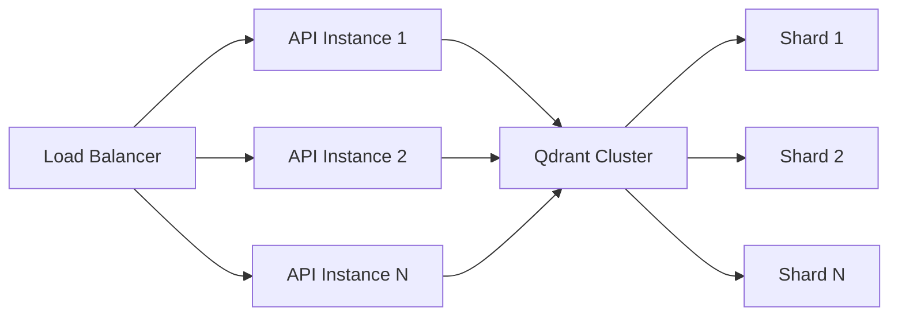

- **Horizontal Scaling**: Multiple API instances
- **Stateless**: No session state in API
- **Shared Vector DB**: All instances use same Qdrant
- **Container Orchestration**: Kubernetes/Docker Swarm

---

## Monitoring & Observability

### Recommended Metrics

1. **Request Metrics**
   - Request rate (req/s)
   - Response time (p50, p95, p99)
   - Error rate

2. **Service Metrics**
   - Embedding generation time
   - Vector search latency
   - Document ingestion rate

3. **Infrastructure Metrics**
   - Qdrant query performance
   - Memory usage
   - Connection pool stats

### Logging Flow

```
Application → Structured Logs → Log Aggregator → Analysis Dashboard
                                        ↓
                                   Alert System
```

---

**End of Project Flow Documentation**
